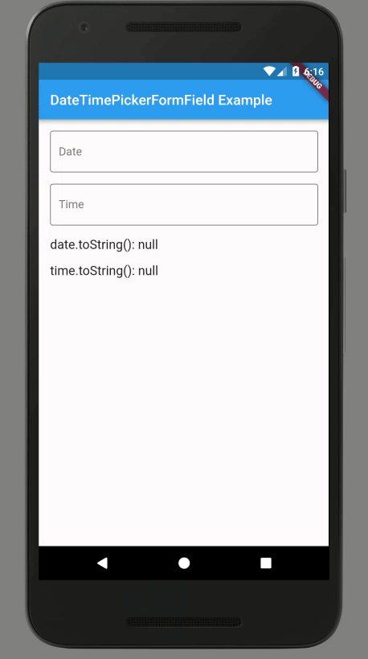

# Date/Time picker FormFields

Two Flutter widgets that wrap a TextFormField and integrates the date and/or time picker dialogs.

Widget | Description
-|-
`DateTimePickerFormField` | For using the date picker and optionally the time picker too. Yields `DateTime` values.
`TimePickerFormField` | For using the time picker only. Yields `TimeOfDay` values.


## Example



```dart
import 'package:flutter/material.dart';
import 'package:intl/intl.dart';
import 'package:datetime_picker_formfield/datetime_picker_formfield.dart';
import 'package:datetime_picker_formfield/time_picker_formfield.dart';

const appName = 'DateTimePickerFormField Example';

void main() => runApp(MaterialApp(
      title: appName,
      home: MyHomePage(),
      theme: ThemeData.light().copyWith(
          inputDecorationTheme:
              InputDecorationTheme(border: OutlineInputBorder())),
    ));

class MyHomePage extends StatefulWidget {
  @override
  MyHomePageState createState() => MyHomePageState();
}

class MyHomePageState extends State<MyHomePage> {
  final dateFormat = DateFormat("EEEE, MMMM d, yyyy 'at' h:mma");
  final timeFormat = DateFormat("h:mm a");
  DateTime date;
  TimeOfDay time;
  @override
  Widget build(BuildContext context) => Scaffold(
      appBar: AppBar(title: Text(appName)),
      body: Padding(
        padding: EdgeInsets.all(16.0),
        child: ListView(
          children: <Widget>[
            DateTimePickerFormField(
              format: dateFormat,
              decoration: InputDecoration(labelText: 'Date'),
              onChanged: (dt) => setState(() => date = dt),
            ),
            SizedBox(height: 16.0),
            TimePickerFormField(
              format: timeFormat,
              decoration: InputDecoration(labelText: 'Time'),
              onChanged: (t) => setState(() => time = t),
            ),
            SizedBox(height: 16.0),
            Text('date.toString(): $date', style: TextStyle(fontSize: 18.0)),
            SizedBox(height: 16.0),
            Text('time.toString(): $time', style: TextStyle(fontSize: 18.0)),
          ],
        ),
      ));
}
```